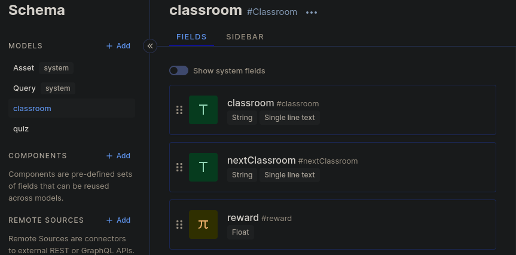
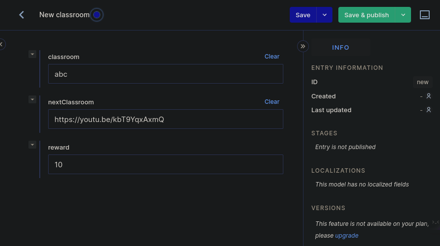
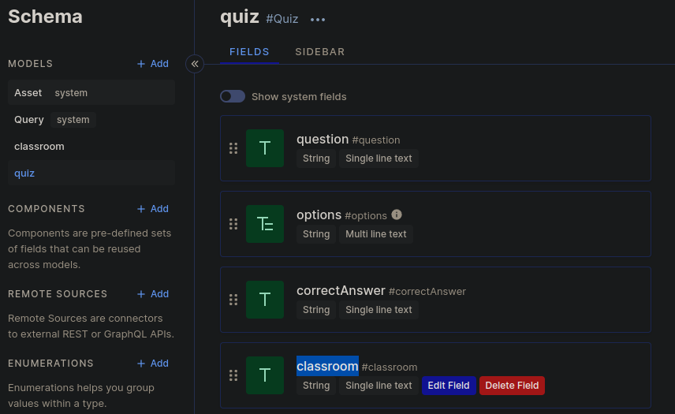
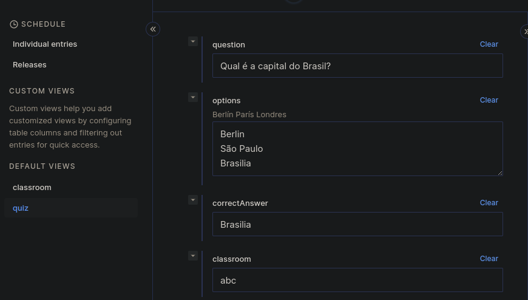

# Satoshi Quiz (Process Payment)

Satoshi Quiz (Process Payment) is a component of the Satoshi Quiz backend system. It focuses on the payment processing aspect of the quiz application. This component is responsible for handling and managing the financial transactions related to quiz participation, rewards, and prize distribution.

# Setting environment variables
To configure environment variables in your project, you can create an .env file in your project root and define the variables you want to use, in the following format:

```bash
# API configuration
API_PORT = 80  # The port number for the API.
API_DNS = "http://localhost:3214"  # The DNS address for the API.

HYGRAPH_URL = ""  # The URL for the Hygraph service.
MEMBER_STACK_API_KEY = ""  # The API key for the Member Stack service.

# Lndhub configuration
LNDHUB_URL = "https://ln.getalby.com"  # The URL for the Lndhub service.
LNDHUB_USERNAME = ""  # The username for the Lndhub service.
LNDHUB_PASSWORD = ""  # The password for the Lndhub service.
```

### Configuring Lightning Wallet
To configure the Lightning wallet that will serve as a wallet for the distribution of prizes, follow the tutorial at: https://blog.getalby.com/bluewallet-alby-how-to-switch-lndhub/. When you get a URL that looks a lot like the following, you'll need to split the URL into two pieces of random digits and assign them to the `LNDHUB_USERNAME` and `LNDHUB_PASSWORD` environment variables, respectively. Once this is done, you are ready to proceed.

```bash
# Lndhub configuration
LNDHUB_URL = "https://ln.getalby.com"  # The URL for the Lndhub service.
LNDHUB_USERNAME = "9be40f1c4119c683"  # The username for the Lndhub service.
LNDHUB_PASSWORD = "f5faf044b2cc25d2"  # The password for the Lndhub service.
```

### Configuration Hygraph
To get started create an account on the hygraph.com service and create a shema in (Schema) with the titles in the following models `classroom` and `quiz`

### Classroom


- classroom [Single line text]
- nextClassroom [Single line text]
- reward [Float]

In the "Content" menu, you can create your Quiz, starting with creating the classroom in Add entry. In this classroom, you will enter the class title, the link to the next class and the reward that this Quiz will offer if the person gets all the questions right.


### Quiz

- question [Single line text]
- options [Multi line text]
- correctAnswer [Single line text]
- classroom [Single line text]

In the "Content" menu, you can create your Quiz, starting by creating in the "Quiz" tab under "Add entry". The "question" is the question you will ask the user, for example: "What is the capital of Brazil?". The "options" are the options that will be shown for the user to select, such as: "Berlin, São Paulo, Brasilia". The "correctAnswer" field is the correct answer from the provided options. "Classroom" is the name of the room you created.



After setting up your first quiz, it's time to get the public Hygraph API, which will be used to query the content.

You can find it in Project settings/Content API. Copy the URL and add it to the environment variable:

```bash
HYGRAPH_URL = "https://api-sa-east-1.hygraph.com/v2/f5faf044b2cc25d2/master" 
```

### Configuring Member Stack for the authorization

Create an account at https://app.memberstack.io and generate an API Key at https://app.memberstack.io/developers, then add it to this environment variable:

```bash
MEMBER_STACK_API_KEY = "7ba725fece857d23077b5eb002771d41"
```

## Launching the application with Docker.

Here's how to run the app using `docker-compose.yml` without needing to configure Redis and Kafka:

- Install `docker` and `docker-compose`: Before starting, you must have `docker` and `docker-compose` installed on your machine. You can find installation instructions for both software in the Docker documentation.
- Use the command `docker-compose --env-file .env up -d --remove-orphans` to run the bifrost application easily.
- Use the command `poetry run app` to run application.
